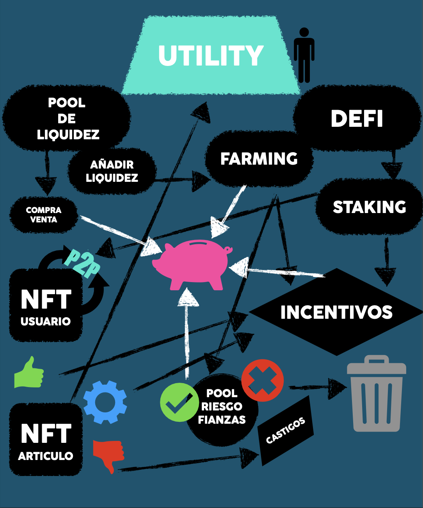

# Whitepaper "PannGo" 
## Travel. Earn. Tribe.

> **Es la primera plataforma turística colaborativa que convierte artículos infrautilizados y conocimiento local en experiencias IRREPETIBLES, accesibles, trazables y ecológicas.
Hoy el viajero se encuentra con ofertas abusivas, sobrecargos de equipaje y un mercado donde los grandes conglomerados absorben más del 80 % del beneficio, mientras millones de residentes guardan equipo o talento que termina ocioso o en la basura.**

---

## 📋 Contenido

1. [Resumen Ejecutivo](#resumen-ejecutivo)
2. [El Problema](#el-problema)
3. [La Solución](#la-solución)
4. [Validación de Mercado](#validación-de-mercado)
5. [Modelo de Negocio](#modelo-de-negocio)
6. [Proyecciones Financieras](#proyecciones-financieras)
7. [Tokenomics](#tokenomics)
8. [Roadmap](#roadmap)
9. [Equipo](#equipo)
10. [Estructura Legal](#estructura-legal)
11. [Inversión](#inversión)

---

## Resumen Ejecutivo

**Pann Go** redistribuye el valor del turismo global hacia comunidades locales mediante una plataforma web 2.0 conecta viajeros con equipos y experiencias auténtica, complementada por un ecosistema web 3.0 descentralizado que agrega valor a nuestros inversionistas y usuarios.

### 🎯 Tesis de Inversión

| Métrica | Valor |
|---|---|
| **Capital solicitado** | $1.43M USD |
| **Mercado direccionable** | $272Bn SAM |
| **Validación piloto** | $236K GMV en 90 días |
| **EBITDA Año 1** | $80K - $1.1M (según escenario) |
| **ROI proyectado (3 años)** | 120% - 450% |
| **Break-even** | Año 1 |

### ⚡ Por qué ahora

1. ✅ **Validación real:** 14,353 usuarios y $236K GMV sin publicidad masiva
2. ✅ **Inventario listo:** 350K experiencias vía API Amadeus/Viator
3. ✅ **Timing perfecto:** Post-pandemia, demanda sostenibilidad + adopción crypto
4. ✅ **Equipo probado:** 20+ años experiencia emprendiendo y una aliznza estrategica con una incubadora aceleradora "tutellus"

---

## El Problema

### 🚫 Crisis en la industria turística

**El viajero actual enfrenta:**

1. **Sobrecargos y restricciones de equipaje**
   - Airlines cobran $50-450 por equipaje adicional
   - Límites de peso y dimenciones obligan a dimitir de actividades 
   - Compra de artículos de un solo uso que terminan en basura

2. **Fragmentación del mercado**
   - Sin integración entre servicios o productos
   - Experiencias desconectadas 

3. **Extractivismo de valor**
   - OTAs (Booking, Expedia, Airbnb) capturan hasta el 35% de comisión
   - Poco valor llega a habitantes y proveedores locales
   - Comunidades no se benefician del turismo

4. **Impacto ambiental**
   - Millones de toneladas de equipaje trasportado innecesariamente 
   - Productos de un solo uso terminan en la basura
   - Alta huella de carbono

### 💡 La oportunidad

Existe un mercado masivo de:
- **Equipos infrautilizados:** Millones de personas tienen equipo (carpas, drones, bicicletas, cámaras, instrumentos) que usan 2-3 veces/año o menos
- **Conocimiento local:** Guías, expertos, aventureros sin herramientas para monetizar mas.
- **Viajeros conscientes:** Dispuestos a pagar por experiencias auténticas y sostenibles

---

## La Solución

### 🌟 PannGo: Economía colaborativa tokenizada para viajes "Travel. Earn. Tribe."

**Una plataforma que conecta:**

```
VOYAGERS          FACILITADORES        AGENTES           DTs
(viajeros)    +   (equipos)       +   (experiencias) +  (referidores)
    ↓                  ↓                    ↓                ↓
ALQUILA EQUIPO    RENTA SUS          CREA TOURS      RECOMIENDA
 in-destino       ARTÍCULOS          AUTÉNTICOS      Y GANA 1%
```

### 🎭 Roles del ecosistema

#### 1. **Voyager** (Viajero)
**Qué hace:**
- Alquila equipos (drones, bicicletas, carpas, cámaras)
- Reserva experiencias locales auténticas
- Viaja ligero, sin sobrecargos

**Beneficio:**
- Viaja ligero
- Ahorra costes en equipaje
- Accede a experiencias únicas
- Contribuye a economía circular

#### 2. **Facilitador** (Propietario de equipos)
**Qué hace:**
- Publica tus artículos infrautilizados en la plataforma.
- Réntalos cuando no los uses.
- Puede contratar Riders para entrega/recolección.

**Beneficio:**
- Rentabilidad en equipos ociosos
- Asignacion de precios (sin intermediarios)
- Maximisas usos, disminuyes huella ambiental
  
#### 3. **Agente** (Creador de experiencias)
**Qué hace:**
- Diseña tours, actividades y rutas auténticas.
- Valida experiencias in-situ.
- combina equipos de Facilitadores.

**Beneficio:**
- Monetiza tu expertise
- Construye reputación verificable
- Maximiza el recuerdo del destino

#### 4. **Rider** (Logística)
**Qué hace:**
- Entrega y recoge equipos.
- Facilita movilidad de artículos.
- Amplía cobertura logistica de la plataforma.

**Beneficio:**
- ngreso flexible (como Uber/Rappi)
- Sin inventario propio
- Trabaja cuando quieras

#### 5. **Holder** (Almacenamiento)
**Qué hace:**
- Provee espacio de almacenamiento temporal.
- Custodia equipos cuando Facilitador no puede.
- Valida condición de artículos.
  
**Beneficio:**
- Monetiza espacio vacío
- Ingreso pasivo sin esfuerzo
- Ganancias de inventario

#### 6. **DT - Dealer Traveler** (Referidor)
**Qué hace:**
- Comparte link/QR de PannGo.
- Invita viajeros y proveedores.
- Construye red de usuarios activa.

**Beneficio:**
- 1% VITALICIO de TODAS las transacciones de tus referidos
- Comisión TRANSFERIBLE (puedes venderla)
- Comisión HEREDABLE (pasa a beneficiarios)

---

### 🔗 Ventaja competitiva: Multi-rol

**Único en la industria:**
- Un mismo usuario puede ser Voyager + Facilitador + DT simultáneamente.

- Un mochilero puede alquilar una bicicleta,
- poner su dron en renta,
- Referir viajeros en el hostal donde se hospeda
(ganando 1% de todos los viajes de los huéspedes).

**Resultado:**
- Mayor engagement
- Network effects exponenciales

---

### 🌐 Inventario inmediato: 350K experiencias

**Estrategia híbrida:**

```
API Partners (Amadeus + Viator)
↓
350,000 tours/experiencias globales
↓
Disponibles desde día 1
↓
DTs pueden mostrar oferta inmediata
↓
Supply local P2P crece orgánicamente
↓
Migración gradual: API (8% margen) → Local (18% margen)
```

**Ventaja:**
- Resuelve "chicken & egg" de marketplaces
- Tenemos Oferta para disminuir la recistencia de adopcion por parte de los Facilitadores
- DTs no llegan a ciudad vacía
- Viajeros encuentran opciones desde día 1
- Supply local se suma a inventario existente

---

## Validación de Mercado

### 📊 TAM - SAM - SOM

| Métrica | Valor | Fuente |
|---|---|---|
| **TAM** (Turismo global) | $679 Bn/año | UNWTO 2024 |
| **SAM** (Plataformas nicho) | $272 Bn | 40% del TAM |
| **SOM** (Captura 3 años) | $8.1M GMV | 0.003% del SAM |

**Oportunidad real:**
- Alquiler P2P de equipos: ~$10-15 Bn
- Experiencias locales: ~$20-30 Bn
- **PannGo captura valor NUEVO, no compite por cuota existente**

---

### ✅ Piloto 2: Validación Real

**Ruta Tuxtla (México) - Colón (Panamá) | 2024**

#### Métricas operativas

| Métrica | Resultado |
|---|---|
| **Duración** | 121 días (31 onboarding + 90 operativos) |
| **Usuarios registrados** | 14,353 |
| **Usuarios con transacciones** | 2,321 (16.2% conversión) |
| **Transacciones totales** | 2,752 |
| **GMV** | $236,000 USD |
| **Ticket promedio** | $85.76 |
| **Inversión** | $120,000+ en prestamo|

#### Composición de usuarios

- **75.6%** actuaron como proveedores (10,850)
- **59.8%** actuaron como consumidores (8,580)
- **29.4%** actuaron como DTs (4,218)

**Insight clave:** Los usuarios NO están segmentados. Un mismo viajero alterna entre roles, creando network effects multiplicativos.

#### Mix de productos

- **86%** Alquiler de equipos ← Core del negocio
- **34%** Experiencias/tours ← Complementario
- **Producto estrella:** Combo 4 sillas + sombrilla playa

*(Nota: Suma >100% porque algunas transacciones combinaron ambos)*

#### Modelo operativo del piloto

```
1 persona (founder) + $120K capital
    ↓
Viajando físicamente Tuxtla → Colón
    ↓
Captando usuarios cara a cara
    ↓
Sin ads
    ↓
= 14,353 usuarios, $236K GMV
```

---

### 🤔 ¿Por qué no escalaron inmediatamente?

**Contexto:** Tras validar Product-Market Fit con métricas sólidas, evaluamos estructura óptima de capitalización.

**Decisión estratégica:**
En lugar de aceptar términos que hubieran diluido excesivamente al equipo fundador, optamos por pausar y estructurar una ronda profesional con:

- ✅ Términos equitativos para founders y early investors
- ✅ Estructura legal descentralizada (DAO + UAE)
- ✅ Tokenomics que alinean incentivos largo plazo
- ✅ Capitalización suficiente para escalar globalmente

**Resultado:** Levantamos ahora con modelo probado, métricas validadas, y términos que protegen la misión descentralizada.

---

### 🎯 Del piloto artesanal a la estructura empresarial

#### Lo que el piloto demostró:

> Si **1 persona**, sin estructura empresarial, sin marketing, generó $236K GMV...
> 
> ...una operación profesional con equipo, procesos, marketing y tecnología puede **multiplicar estos resultados .**

#### Ventajas competitivas vs piloto:

| Factor | Piloto | Año 1 V1.0 | Mejora |
|---|---|---|---|
| **Equipo en campo** | 1 persona | 3 personas | 3x |
| **Soporte remoto** | 1 persona | Sergio + coordinación | +50% |
| **Inventario inicial** | 0 (convencer desde cero) | 350K experiencias API | +40% |
| **Publicidad** | $0 | $280K dirigida | +30% |
| **Procesos** | Improvisados | Manual operativo documentado | +20% |
| **Tiempo operativo** | 90 días | 365 días | 4x |
| **Cobertura** | ~35 destinos | 400 destinos | 11.4x |

---

### 📈 Estrategia de crecimiento: DTs naturales distribuidos

**Pann Go NO depende de equipo centralizado de ventas.**

En su lugar, activa **DTs naturales** presentes en cada destino:

#### DTs naturales por ciudad:

**1. Hostales/Hostels** (>20 por ciudad)
- Póster QR permanente en frontdesk
- Captación pasiva:  usuarios >1 /día
- Win-win: Hostal gana 1% vitalicio de todos sus huéspedes 

**2. Mochileros activos** (>100 por ciudad/mes)
- Dedican  a captar mientras viajan
- >1 usuarios/día
- Ingreso pasivo perpetuo

**3. Comercios locales** (cafés, tours, tiendas)
- Póster QR en punto de venta
- Captación incidental

**4. Microinfluencers de viaje**
- Share en redes
- Comisión de sus seguidores

#### Ventaja del catálogo API:

Los DTs **NO** llegan a ciudad vacía. Desde día 1 pueden mostrar:
- "Mira, ya hay 30 experiencias en este pueblo"
- "Solo falta que agregues TU equipo/expertise"
- Reduce fricción de onboarding

#### Proyección conservadora:

```
50 ciudades objetivo Año 1
× 30 hostales promedio
× 7 usuarios/día promedio
× 365 días


Conservador al 5-10% conversión = 38K usuarios
```

---

## Modelo de Negocio

### 💰 Estructura de comisiones


PannGo opera con **dos líneas de negocio** con márgenes diferentes:

#### 1. Economía Colaborativa P2P (Core - Mayor margen)

**Alquiler de artículos entre particulares + Experiencias de Agentes locales**

```
Transacción: $100
    ↓
Fee total: 18% = $18
    ├─ Motores/Pasarela: 8% = $8
    └─ Bruto PannGo: 10% = $10
        ├─ DT Proveedor: 1% = $1 (si aplica)
        ├─ DT Cliente: 1% = $1 (si aplica)  
        └─ Neto PannGo: 8-10% = $8-10

Proveedor recibe: $82
```

**Margen neto PannGo:** 8-10% (según si hay DTs)

#### 2. Experiencias Curadas (Complemento - Menor margen)

**Tours vía APIs (Amadeus/Viator)**

```
Transacción: $100
    ↓
Margen wholesale/afiliación: 8% = $8

Cliente paga: $100
Proveedor API retiene: $92
PannGo recibe: $6-8
```

**Margen neto Pann Go:** 8% fijo

---

### 📊 Evolución del mix (estrategia 3 años)

#### Año 1: Fase de Onboarding
```
Mix: 90% API + 10% Local
Margen promedio: 9%
```
**Foco:** Captar usuarios con inventario existente, construir base de Facilitadores

#### Año 2: Migración Gradual
```
Q1: 80% API + 20% Local → Margen 10%
Q2: 70% API + 30% Local → Margen 11%
Q3: 60% API + 40% Local → Margen 12%
Q4: 50% API + 50% Local → Margen 13%

Margen promedio: 11.5%
```
**Foco:** Supply local crece, Riders/Holders activan logística

#### Año 3: Dominancia Local
```
Q1: 40% API + 60% Local → Margen 14%
Q2: 30% API + 70% Local → Margen 15%
Q3: 25% API + 75% Local → Margen 15.5%
Q4: 20% API + 80% Local → Margen 16%

Margen promedio: 15.1%
```
**Foco:** Economía colaborativa consolidada, API complementa

---

### 🔄 Diagrama de valor

```
        VIAJERO
           ↓
    Renta equipo $100
           ↓
    ┌──────┴──────┐
    │  PANN GO    │
    │  Fee $18    │
    └──────┬──────┘
           ↓
    ┌──────────────────────┐
    │                      │
    ├─ Motores $8         │
    ├─ DT Proveedor $1    │
    ├─ DT Cliente $1      │
    └─ Neto Pann Go $8    │
           ↓
    FACILITADOR recibe $82
```

---

### 🎁 Ingresos adicionales

1. **NFTs**
   - PersonaNFT: pasaporte del usuario
   - GearNFT: $3 por artículo

2. **Token Sale**
   - Venta inicial $TRVL
   - Pool de liquidez

3. **Staking rewards**
   - Fees de transacciones en pool

4. **Concesiones futuras**
   - Licencias territoriales a operadores locales  CM y CL

---

### ⚙️ Manual Operativo: Crecimiento estructurado

#### Rol: Sergio (Asistente Local Remoto)

**Objetivo:** Preparar terreno digital 30 días antes de llegada de brigada

**Responsabilidades:**

1. **Prospección en redes**
   - Interacción orgánica en Facebook, WhatsApp, Telegram
   - Despertar curiosidad sin spam
   - Ejemplo: "¿Alguien renta equipo de camping en Medellín?"

2. **Búsqueda activa**
   - Google Maps: detectar hostales, guías, campings
   - Contacto vía WhatsApp/email

3. **Contacto inicial con valor**
   - Mensajes cortos generando interés
   - Ejemplo: "Colaboro con proyecto que ayuda a hostales a ganar ingresos extra vitalicios por cada huésped. ¿Agendamos charla con Fabio que llega tal día?"

4. **Agenda citas calificadas**
   - Lista semanal de prospectos
   - Confirmar disponibilidad antes de llegada

5. **Soporte a brigada**
   - Organizar contenido (fotos, videos)
   - Búsqueda de servicios (mecánicos, farmacias)
   - Seguimiento remoto de contactos

#### Publicidad dirigida por destino

**30 días antes de llegada:**
- Campaña Facebook/Instagram Ads
- Targeting: personas en ciudad objetivo interesadas en viajes, outdoor, aventura
- Budget: ~$700 por ciudad
- Mensaje: "Pann Go llega a [Ciudad] - Alquila equipo, ofrece experiencias, gana comisiones vitalicias"

**5 días antes:**
- Retargeting intensivo
- Audiencias precalentadas
- Conversión optimizada

**Durante estancia:**
- Brigada cierra leads calientes
- Citas agendadas por Sergio
- Alta conversión

---

## Proyecciones Financieras

### 💼 Gastos operativos Año 1

| Rubro | Anual (USD) |
|---|---|
| **Nómina** | 144,000 |
| Legal | 36,000 |
| Contabilidad | 36,000 |
| **Publicidad** | 280,000 |
| Infraestructura tech | 48,000 |
| Imagen y marca | 72,000 |
| **Viajes** (brigada 3 personas) | 200,000 |
| Subcontrataciones | 144,000 |
| Inteligencia artificial | 24,000 |
| Tokenización | 14,000 |
| Pool de liquidez | 75,000 |
| **TOTAL** | **$1,073,000** |

**Capital solicitado:** $1,430,000
- Gastos operativos: $1,073,000
- Buffer/contingencia: $357,000 (25%)

---

### 📊 Análisis de Sensibilidad: 4 Escenarios

**Metodología:**
Proyectamos múltiplos de eficiencia vs piloto validado (14,353 usuarios en 90 días con 1 persona, sin ads, sin estructura).

#### **Multiplicadores considerados:**

| Factor | Piloto | Año 1 | Impacto |
|---|---|---|---|
| Personas en campo | 1 | 3 | 3x base |
| Tiempo operativo | 90 días | 365 días | 4x base |
| Soporte remoto | 1 sin metodologia | Sergio + metodologia | +60% eficiencia |
| Publicidad | $0 | $280K | +30% conversión |
| Inventario API | 0 | 350K | +40% cierre |
| Destinos | ~35 | >400 | 11.4x cobertura |

**Base teórica:**
```
14,353 usuarios ÷ 90 días × 365 días × 3 personas = 174,105 usuarios
```

**Con mejoras operativas:**
- Conservador: × 1.3-1.6 = 1740K-234K usuarios del mes 12 al 24


---

### 💹 Proyecciones por escenario

#### ESCENARIO 1: CONSERVADOR (baja eficiencia)

**Asume:** Dificultades de coordinación, curva de aprendizaje del equipo, mercados más difíciles que piloto.


```
PUNTO DE EQUILIBRIO
Transacciones/dia: 560

Ticket promedio: $90

Comision neta por operacion: $7


```

**Mensaje:** Aún con múltiples desafíos operativos, alcanzando esos numeros hay rentabilidad desde Año 2.

---

#### ESCENARIO 2: MODERADO 

**Asume:** Operación normal con aprendizaje gradual, Sergio funciona moderadamente.

```
Transacciones/dia: 680

Ticket promedio: $90

Comision neta por operacion: $7

ROI anual despues del Año 2: +24%
```

**Mensaje:** Con ejecución sólida pero sin excelencia, generamos rentabilidad respetable.

---

#### ESCENARIO 3: OPTIMISTA MODERADO 

**Asume:** Sergio + ads funcionan como esperado, equipo alcanza ritmo productivo en Q2-Q3.

```
Transacciones/dia: 800

Ticket promedio: $90

Comision neta por operacion: $7

ROI anual despues del Año 2: +24%

ROI anual despues del Año 2: +60%
```

**Mensaje:** Si ejecutamos según plan, multiplicamos inversión significativamente en 12 meses.

---

#### ESCENARIO 4: OPTIMISTA 

**Asume:** Todas las piezas funcionan bien, network effects empiezan a activarse, viralidad orgánica.

```
Transacciones/dia: 1010

Ticket promedio: $90

Comision neta por operacion: $7

ROI anual despues del Año 2: +24%

ROI anual despues del Año 2: +80%
```

**Mensaje:** Upside significativo si el modelo escala mejor de lo proyectado.

---

### 📊 Tabla resumen

| Escenario | Multiplicador PE | Usuarios | GMV | EBITDA | ROI |
|---|---|---|---|---|---|
| **Conservador** | 1 | 190K | $18M | $25K | P.E. |
| **Moderado** | 1.24 | 234K | $22M | $264K | +24% |
| **Opt. Moderado** | 1.56| 308K | $26M | $566K | +56% |
| **Optimista** | 1.8| 358K | $33M | $1.1M | +80% |

---

### 🎯 Por qué estas proyecciones son conservadoras

1. **Solo 1.3x-2.5x vs piloto** a pesar de tener:
   - 3x personas en campo
   - 4x tiempo operativo
   - $280K en publicidad
   - 350K inventario disponible
   - Soporte remoto estructurado

2. **No asumimos viralidad extrema**
   - Sin growth hacks explosivos
   - Sin network effects exponenciales
   - Crecimiento lineal controlado

3. **Margen conservador 9% en Año 1**
   - 90% API (8% margen)
   - No proyectamos migración rápida a 18%

4. **Comparacion con apps del mercado**
   - PannGo Punto de Equilibrio   560 operaciones por dia
   - Airb&b hospedajes            1.63M Operaciones por dia
   - Airbnb experiencias          200K Operaciones por dia
   - Viator                       120k Operaciones por dia
   - GetYourGuide                 180k Operaciones por dia
   - Civitatis                    210k Operaciones por dia
   - Rezdy                        170k Operaciones por dia
   - Amadeus / terceros           650k Operaciones por dia

Operaciones por dia en plataformas 3.2M de Operaciones por dia 
el punto de equilibrio representa el .02% de la cuota de mercado 
Nota:  el inventario de articulos no compite con ninguno de los anteriores 


   

---

### 📈 Proyección Años 2-3

#### Año 2: Transición y Aceleración

```
Usuarios acumulados: 500,000-700,000
Activación mejora: 35%
Transacciones/usuario: 3.2
Mix: 50% API + 50% Local (margen 13%)

GMV: $35-50M
EBITDA: $2.5-4M
ROI acumulado: +175%-280%
```

#### Año 3: Dominancia Local

```
Usuarios acumulados: 1,000,000-1,500,000
Activación: 40%
Transacciones/usuario: 4.0
Mix: 20% API + 80% Local (margen 16%)

GMV: $80-120M
EBITDA: $8-12M
ROI acumulado: +450%-750%
```

---

## Tokenomics


### 🪙 Token $TRVL: Utilidad Real

**El token $TRVL es el combustible del ecosistema Pann Go.**

#### Casos de uso:

1. **Reserva sin efectivo**
   - Pagar alquileres y experiencias en $TRVL
   - Descuentos en seguros, depositos y fianzas de entre el 5 al 10%

2. **Pool de garantía y riesgo descentralizado**
   - Stake $TRVL en lugar de depósito fiat
   - Liberación automática post-validación on-chain

3. **Recompensas y governance**
   - Staking rewards
   - Votación en propuestas DAO

4. **Certificación y reputación**
   - PersonaNFT y GearNFT
   - Staking para reputación aumentada

---

### 📊 Distribución de Tokens

**Suministro total: 100,000,000 $TRVL**

| Asignación | % | Tokens | Vesting |
|---|---|---|---|
| **Comunidad DTs** | 20% | 20,000,000 | 25% TGE, 75% lineal 18m |
| **Tesorería Pann Go** | 25% | 25,000,000 | Liberación según roadmap |
| **Proveedores fundadores** | 15% | 15,000,000 | 10% TGE, 90% lineal 24m |
| **DAO Governance** | 15% | 15,000,000 | Desbloqueado cuando DAO activa |
| **Staking & Liquidez** | 15% | 15,000,000 | Liberación gradual según demanda |
| **Equipo & Asesores** | 10% | 10,000,000 | Cliff 6m, vesting 36m |

---

### 💎 Token Sale

#### Fase 1: Seed/Private (Actual)

```
Precio: $3.00 USDT
Tokens vendidos: 476,666 $TRVL

Distribución:
├─ Early investors: 433,333 TRVL ($1,300,000)
└─ Pool liquidez: 43,333 TRVL ($130,000)

Total recaudado: $1,430,000 USDT
```

**Vesting:**
- 20% TGE (Token Generation Event)
- 80% lineal durante 12 meses

#### Fase 2: Public Sale (Q2 2026)

```
Precio: $5.00-8.00 USDT
Target: $2-3M adicional
Uso: Expansión internacional, marketing, DAO treasury
```

---

### 🔐 Smart Contracts

#### 1. PersonaNFT (Reputación soberana)

```
Metadata on-chain:
├─ Historial transacciones
├─ Rating promedio
├─ Siniestros/disputas
├─ Tiempo en plataforma
└─ Badges/logros

Uso:
- Reputación portable entre plataformas
- Staking para mayor visibilidad
- Descuentos por buen comportamiento
```

#### 2. GearNFT (Trazabilidad de artículos)

```
Metadata on-chain:
├─ Propietario actual
├─ Historial de uso
├─ Valor de reposición
├─ Fotos/condición
└─ Póliza de seguro

Uso:
- Certificado de autenticidad
- Reclamos automatizados ante daños
- Marketplace secundario P2P
```

#### 3. Pool CoverFarm (Seguro descentralizado)

```
Funcionamiento:
1. Usuarios stake $TRVL como garantía
2. Pool cubre daños/pérdidas verificadas
3. Usuarios responsables pierden stake
4. Buenos usuarios recuperan + rewards

Beneficios:
- Sin depósitos fiat congelados
- Incentivos alineados
- Resolución rápida on-chain
```

---

### 🌊 Liquidez y Exchanges

**Fase 1 (2026):**
- Uniswap V3 (Ethereum)
- PancakeSwap (BSC)
- Pool inicial: $130K

**Fase 2 (2027):**
- Listado CEX (Gate.io, MEXC, Bybit)
- Expansión a L2s (Arbitrum, Optimism)

**Fase 3 (2028):**
- Tier 1 exchanges (Binance, Coinbase)
- Cross-chain bridges

---

## Roadmap

### 🗓️ 2025: Preparación

**Q4 2025:**
- ✅ Cierre ronda seed ($1.43M)
- ✅ Estructura legal (UAE + Wyoming DAO)
- ✅ Desarrollo V1.0 plataforma
- ✅ Integración APIs (Amadeus/Viator)
- ✅ Manual operativo finalizado

---

### 🚀 2026: Lanzamiento y Validación

**Q1 2026:**
- 🎯 Lanzamiento V1.0 público
- 🎯 Onboarding 190K-358K usuarios (según escenario)
- 🎯 400 destinos activados
- 🎯 $12-24M GMV

**Q2 2026:**
- 🎯 Smart contracts deployed (Ethereum)
- 🎯 Mint PersonaNFT y GearNFT
- 🎯 Token $TRVL listado (Uniswap)
- 🎯 Public sale

**Q3 2026:**
- 🎯 Comunidad de Agentes (programa incentivos)
- 🎯 Asistente IA personalizado
- 🎯 Riders y Holders activos en 50 ciudades
- 🎯 GearNFT marketplace beta

**Q4 2026:**
- 🎯 Onboarding masivo (eventos presenciales)
- 🎯 Estaciones Pann Go (primeros 10 hubs)
- 🎯 App móvil iOS/Android
- 🎯 Listing en CEX tier 2

---

### 🌍 2027: Expansión Internacional

**Q1 2027:**
- 🎯 DAO Beta (votaciones test)
- 🎯 Expansión Europa (100 ciudades)
- 🎯 Expansión MENA (150 ciudades)
- 🎯 Matching "Confesiones" (IA conecta afines)

**Q2 2027:**
- 🎯 Concesiones territoriales (primeros 5 operadores)
- 🎯 Carteleras locales dinámicas
- 🎯 Staking v2 (rewards optimizados)
- 🎯 Impulsores (rol acelerador crecimiento)

**Q3 2027:**
- 🎯 RTsan (NFTs artesanías auténticas)
- 🎯 Integración marketplaces (Amazon, Mercado Libre)
- 🎯 Cross-chain (Polygon, Arbitrum)

**Q4 2027:**
- 🎯 DAO transición (50% decisiones comunitarias)
- 🎯 1000 ciudades activas
- 🎯 $100M+ GMV anual

---

### 🏛️ 2028: Descentralización Completa

**Q1 2028:**
- 🎯 DAO Plena (governance 100% comunitaria)
- 🎯 Primera ola concesiones (12 territorios)
- 🎯 Holders proponen futuribles
- 🎯 Presupuestos DAO por votación

**Q2 2028:**
- 🎯 Capitalización futuribles votados
- 🎯 Expansión Asia (200 ciudades)
- 🎯 Expansión África (100 ciudades)

**Q3 2028:**
- 🎯 Roadmap cerrado V1.0
- 🎯 Inicio desarrollo V2.0
- 🎯 Ecosistema autosostenible

**Q4 2028:**
- 🎯 V2.0 specifications publicadas
- 🎯 2000+ ciudades globales
- 🎯 $250M+ GMV anual

---

## Equipo

### 👔 Founders

#### **Fabio de Savorgnani** - CEO & Founder

**Formación:**
- Ingeniería en Telecomunicaciones (CNNCI Cancún, 1996-2000)
- Máster en Logística de Procesos Industriales y Operativos (Cambridge, 2012)

**Trayectoria:**
- 20+ años lanzando empresas de tecnología e imagen
- Primer emprendimiento a los **14 años**: Pizzería Don Tino
- A los **16 años**: Sala de videojuegos "sin consolas"
- Fundador de **TTE** y **G7 Gráfico** (empresas exitosas en sus rubros)

**En Pann Go:**
- Ejecutó pilotos Costa Rica 2018 y Tuxtla-Colón 2024
- Facturó $236K en 90 días con recursos mínimos
- Captó 14,353 usuarios de forma artesanal

**Superpoder:** Resiliencia extrema y ejecución contra todo pronóstico.

---

### 🌟 Core Team

| Nombre | Rol | Superpoder |
|---|---|---|
| **Tutellus** | Partnership Web3 y App 2.0 | Líder Web3 desde 2017, con 2M+ usuarios y expertise en tokenización educativa. Como socios, impulsamos tu proyecto Web3 & App 2.0: desarrollo de tokens, smart contracts y DApps. Monetiza conocimiento, accede a ecosistema global y acelera ROI vía educación descentralizada." |

---

### 🎯 Advisors (por confirmar)

- **Blockchain/DeFi:** Experto en tokenomics y smart contracts
- **Turismo:** Ex-ejecutivo OTA con 15+ años industria
- **VC/Fundraising:** Partner en fondo crypto/Web3
- **Operaciones:** Experto en marketplaces y economía colaborativa

---

## Estructura Legal

### 🏛️ Arquitectura Jurisdiccional

```
┌─────────────────────────────────────┐
│   HOLDING: UAE Free Zone (ADGM)    │
│   - Cero impuestos corporativos    │
│   - Framework crypto-friendly       │
│   - Protección de assets           │
└────────────┬────────────────────────┘
             │
    ┌────────┴────────┐
    │                 │
┌───▼────────────┐  ┌─▼──────────────┐
│ OPERATING CO:  │  │ DAO GOVERNANCE:│
│                │  │ Wyoming LLC    │
│ - Operaciones  │  │ - Votaciones   │
│ - Contratos    │  │ - Tesorería    │
└────────────────┘  └────────────────┘
```

### 📋 Razones estratégicas:

**Sortear a la SEC**
- ✅ Framework regulatorio crypto-friendly
- ✅ Cero impuestos corporativos en Free Zones
- ✅ Proximidad a mercados objetivo (MENA + África)
- ✅ Sin exposición a regulación SEC

**Wyoming DAO LLC:**
- ✅ Primera jurisdicción US que reconoce DAOs
- ✅ Protección legal para gobernanza descentralizada
- ✅ Estructura flexible para voting rights

---

### 🌍 Restricciones Geográficas

**❌ NO disponible en:**
- Países sancionados OFAC (Irán, Corea del Norte, etc.)

**✅ Disponible en:**
- 150+ países
- Foco inicial: MENA, LATAM, Europa, Asia

---

### 🔐 Token Sale Compliance

**Reg S (Regulation S):**
- Venta exclusiva a persons
- Sin registro SEC requerido
- KYC/AML completo
- Geo-blocking tecnológico

**¿Por qué es legal?**

- No targeting US investors
- Domicilio en jurisdicción crypto-friendly
- Compliance local 

---

### 📄 NFT de Referidos: Aclaración Regulatoria

Los **ReferralNFT** representan un derecho contractual a recibir comisiones de usuarios específicos.

**Características:**
- Transparencia total: Historial on-chain auditable
- Sin garantías: Rendimientos dependen de actividad del referido
- Mercado libre: Precio P2P entre particulares
- Smart contract: Automatiza redistribución

**No es security porque:**
- PannGo NO garantiza rendimientos
- NO fija precios de mercado secundario
- Solo redirige comisiones al nuevo propietario
- Operación en jurisdicción no-US

**Advertencia obligatoria:**
> ⚠️ Este es un activo de riesgo. Comisiones futuras no están garantizadas y dependen exclusivamente de la actividad del referido.

---

## Inversión

### 💰 Términos de la Ronda

| Concepto | Detalle |
|---|---|
| **Monto objetivo** | $1,430,000 USD |
| **Vehículo** | SAFE / Token Warrant |
| **Precio token** | $3.00 USDT |
| **Tokens ofrecidos** | 433,333 $TRVL |
| **Valoración pre-money** | Por negociar |
| **Uso de fondos** | Ver presupuesto detallado arriba |

---

### 🎁 Beneficios para inversionistas

**1. Tokens $TRVL**
- Asignación a precio preferencial ($3 vs $5-8 público)
- Vesting: 20% TGE, 80% lineal 12 meses
- Upside potencial si token aprecia

**2. Comisión DT vitalicia** (opcional)
- Inversionistas pueden registrarse como DT
- 1% de todas las transacciones que generen sus referidos
- Transferible y heredable

**3. Participación DAO**
- Voting rights proporcionales a holdings
- Influencia en decisiones estratégicas
- Acceso a tesorería DAO

**4. Prioridad en concesiones**
- First access a operar territorios como concesionario
- % de comisiones de tu región

---

### 📊 Comparativa con competidores

| Métrica | Airbnb (IPO) | Uber (IPO) | **PannGo** |
|---|---|---|---|
| Años hasta rentabilidad | 12+ | 15+ | **1** |
| Capital pre-rentabilidad | $6Bn+ | $25Bn+ | **$1.43M** |
| Margen bruto | 20% | 15% | **9-18%** |
| EBITDA Año 1 | Negativo | Negativo | **Positivo** |
| Network effects | Alto | Alto | **Muy alto (multi-rol)** |

---

### 🚀 Por qué invertir ahora

**1. Timing perfecto:**
- ✅ Post-pandemia: demanda de sostenibilidad
- ✅ Adopción crypto en masa
- ✅ Cansancio con OTAs extractivas

**2. Validación real:**
- ✅ $236K GMV en 90 días SIN estructura
- ✅ 14,353 usuarios reales
- ✅ Product-Market Fit probado

**3. Ventaja competitiva defendible:**
- ✅ Multi-rol único en industria
- ✅ 350K inventario desde día 1
- ✅ DTs naturales distribuidos

**4. Equipo probado:**
- ✅ 20+ años ejecutando startups exitosas
- ✅ Track record de resiliencia
- ✅ Capacidad de hacer mucho con poco

**5. Upside sin techo:**
- ✅ TAM $272Bn
- ✅ Proyecciones ultra conservadoras
- ✅ Escenarios muestran 6%-77% ROI Año 1
- ✅ Si supera proyecciones: ROI exponencial

---

### 📞 Próximos Pasos

**Interesados en invertir:**

1. **Reunión inicial** (30 min)
   - Presentación deck ejecutivo
   - Q&A sobre modelo

2. **Due diligence**
   - Acceso a data room
   - Métricas del piloto
   - Contratos y estructura legal

3. **Negociación términos**
   - SAFE vs Token Warrant
   - Vesting schedule
   - Participación DAO

4. **Cierre**
   - Firma SAFE/Warrant
   - Transfer USDT
   - Asignación tokens (vested)

---

### 📧 Contacto

**Email:** fabio@panngo.com  
**Website:** https://panngo.com  
**Whitepaper:** https://github.com/fabiosavorgnani/PannGo-whitepaper  
**Video explicativo:** https://youtu.be/uKRWejXHJQo  

**Telegram:** @panngoapp  
**Twitter:** @panngoapp

---

## Anexos

### 📚 Documentos Adicionales

1. **Pitch Deck** (PDF ejecutivo 15 slides)
2. **Financial Model** (Excel detallado 3 años)
3. **Manual Operativo Sergio** (Estrategia de crecimiento)
4. **Contratos Smart** (Auditoría pendiente)
5. **Brand Guidelines** (Identidad visual completa)

### 🎨 Assets Visuales

- Logos (PNG, SVG)
- Mockups plataforma
- Diagrama tokenomics
- Diagrama flujo comisiones
- TAM-SAM-SOM visual

---

## Glosario

**Voyager:** Viajero que consume experiencias y alquila artículos.

**Facilitador:** Propietario que renta sus artículos infrautilizados.

**Agente:** Creador local de experiencias auténticas.

**Rider:** Proveedor de logística (entrega/recolección de equipos).

**Holder:** Proveedor de almacenamiento temporal.

**DT (Dealer Traveler):** Referidor que gana comisiones vitalicias.

**$TRVL:** Token utility del ecosistema Pann Go.

**PersonaNFT:** NFT de reputación on-chain.

**GearNFT:** NFT que certifica y traza artículos.

**CoverFarm:** Pool descentralizado de garantías.

**DAO:** Organización Autónoma Descentralizada.

**GMV:** Gross Merchandise Value (volumen bruto de transacciones).

**TGE:** Token Generation Event.

**Vesting:** Liberación gradual de tokens en el tiempo.

---

## Referencias Legales

Este documento no constituye una oferta de valores ni una solicitud de inversión en jurisdicciones donde esto requiera registro. Las proyecciones financieras son estimaciones basadas en asunciones que pueden variar. Inversores deben realizar su propia due diligence.


---

**Última actualización:** 14 Octubre 2025  
**Versión:** 2.0  
**Confidencial:** Para inversionistas calificados únicamente  

---

*Pann Go — Travel. Earn. Tribe.*  
*Transformamos viajes en cadenas de valor circulares donde la riqueza permanece en manos de quienes la generan.*
