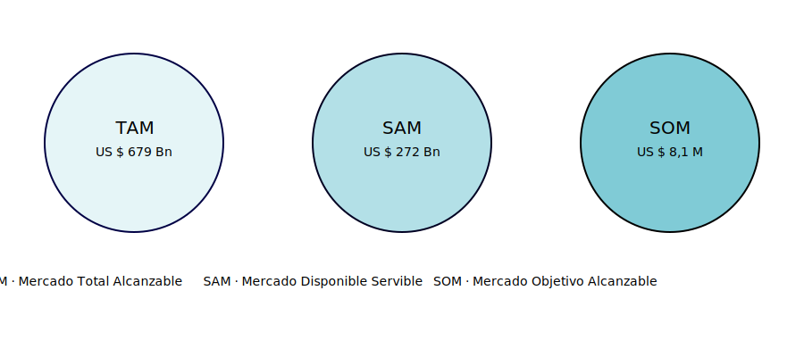
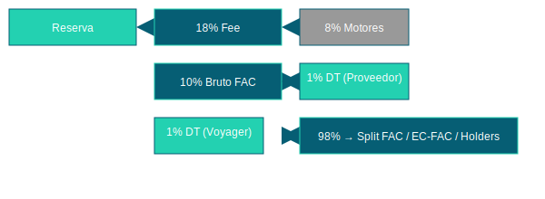

# FAC — Folklore, Adventure & Culture  
## Whitepaper v1 (julio 2025)

## Índice

1. [Síntesis](#1-síntesis)  
2. [Introducción](#2-introducción)  
3. [Equipo y Superpoderes](#3-equipo-y-superpoderes)  
4. [Identidad de Marca](#4-identidad-de-marca)  
5. [Producto + Mercado](#5-producto--mercado)  
6. [Modelo de Negocio](#6-modelo-de-negocio)  
7. [Economía del Token](#7-economía-del-token)  
8. [Roadmap](#8-roadmap)  
9. [Capitalización y Financiamiento](#9-capitalización-y-financiamiento)  
10. [Futuribles](#10-futuribles)  
11. [Anexos](#11-anexos)  
12. [Glosario](#12-glosario)  
13. [Referencias Legales](#13-referencias-legales)

---

## 1. Síntesis
FAC, la plataforma de viajes comprometida con grandes impactos.

## 2. Introducción

FAC (Folklore, Adventure & Culture) es la **primera plataforma turística colaborativa** que convierte artículos infrautilizados y conocimiento local en experiencias **IRREPETIBLES, accesibles, trazables y ecológicas**.  
Hoy el viajero se encuentra con ofertas abusivas, sobrecargos de equipaje y un mercado donde los grandes conglomerados absorben más del 80 % del beneficio, mientras millones de residentes guardan equipo o talento que termina ocioso o en la basura.

### Roles que articulan la solución
- **Voyager** – viajero que consume experiencias y alquila artículos in-situ.  
- **Agente** – creador local de experiencias auténticas.  
- **Facilitador** – propietario que renta sus artículos para enriquecer el viaje.  

FAC redistribuye los ingresos **simplemente recomendando** gracias al rol:
- **DT (Dealer Traveler)** – genera comisiones **vitalicias, transferibles y heredables** por cada usuario referido.

### Web 3.0 desde el día uno
La confianza se respalda *on-chain* con **PersonaNFT** y **GearNFT**, mientras el token **$TRVL** sustituye los depósitos en garantía mediante un **pool de riesgo descentralizado**.

### Validación en el mundo real
Dos pilotos previos — *Costa Rica 2018* y *Ruta Tuxtla-Colón 2024* — comprobaron la tracción del modelo con **US $236 000 facturados en 90 días**, sin inversión publicitaria masiva.

### Timing perfecto
El turismo post-pandemia exige sostenibilidad; la tokenización redistribuye riqueza; la adopción cripto crece a raudales. El **V1.0** se lanzará en **Q1 2026** con **9 000 proveedores iniciales** y un EBITDA positivo antes de cerrar el año.  

FAC no solo recorta costos y CO₂: **convierte cada viaje en una cadena de valor circular** donde la riqueza permanece en manos de quienes la generan.

---

## 3. Equipo y Superpoderes

### 3.1 CEO

| Nombre                 | Formación                                                   | Trayectoria                                                                                                            | Logros clave                                                                                             |
|------------------------|-------------------------------------------------------------|------------------------------------------------------------------------------------------------------------------------|----------------------------------------------------------------------------------------------------------|
| **Fabio de Savorgnani**| • Ingeniería Telemática (TTE)   • Branding (G7 Gráfico) | 20 años lanzando empresas de tecnología e imagen.   Primer emprendimiento a los **14 años**: pizzería *Don Tino*.   A los **16 años** montó sala de videojuegos “sin consolas”.| • Fundó **TTE** y **G7 Gráfico**.   • Pilotó FAC (Costa Rica & Ruta Tuxtla-Colón) facturando **US $236 k** en 90 días.|

> **Súper-poder del CEO:** Resiliencia extrema y visión para convertir cualquier idea en un negocio rentable.

### 3.2 Core-team

| Nombre                         | Súper-poder                                                                              |
|--------------------------------|------------------------------------------------------------------------------------------|
| **Josué González**             | Hipercierre: convierte leads en ventas con velocidad y empatía récord.                   |
| **Héctor Salinas**             | Ingeniería imposible: diseña hardware, drones e IoT que funcionan en cualquier entorno.   |
| **Leonardo Villalobos**        | Arquitecto de nubes invulnerables: 99.99 % uptime mientras recorta facturas cloud.        |
| **Johnny Miguel Carleo**       | Puente mediático global: media y alianzas que multiplican visibilidad internacional.      |
| **María Lucia Carrizo**        | Rastreadora de shoppers: identifica patrones de compra y dispara ROAS en multicanal.      |
| **Gabriel Rodríguez Pastrana** | Narrador visual imparable: convierte conceptos en motion graphics y virales.             |
| **Gabriel Moran**              | Alquimista de marcas: destila esencia de proyecto en identidades memorables en 24 h.     |
| **Mauricio Islas**             | Amplificador de audiencias: comunica a millones en EE UU y LATAM.                         |
| **Carlos Domínguez Nataren**   | Escudo fiscal: vehículos legales que minimizan riesgo e impuestos.                       |

---

## 4. Identidad de Marca

**Paleta de colores:**  
- Azul FAC: #1E3A8A  
- Verde ECO: #10B981  
- Naranja ACT: #F59E0B  
- Gris Neutro: #6B7280  

**Tipografías:**  
- **Titulares:** Mikado Bold  
- **Texto:** Mikado Regular  

> *Por favor, agrega aquí los logotipos en `.png` y los íconos `.svg` en la carpeta `assets/brand/`.*

---

## 5. Producto + Mercado

### 5.1 La version  1.0 

FAC V1.0 integra en una sola app **la renta de artículos, experiencias P2P, economía colaborativa y un potente sistema de referidos con comisiones vitalicias, transferibles y heredables.**

| Rol             | Acción principal                                    | Beneficio directo                                                   |
|-----------------|-----------------------------------------------------|---------------------------------------------------------------------|
| **Voyager**     | Alquila artículos in-situ y reserva experiencias.   | Viaja ligero y accede a actividades auténticas.                    |
| **Agente**      | Publica itinerarios validados por QR.               | Monetiza su expertise local y gana reputación on-chain.            |
| **Facilitador** | Renta artículos infrautilizados (dron, camper).     | Convierte trastos en ingresos y fomenta economía circular.         |
| **DT**          | Recomienda usuarios con link/QR.                    | Cobra **1 % vitalicio, transferible y heredable** sin invertir.     |

> **Ventaja clave:** ningún competidor global une alquilar gear + tours P2P + tokenización ecológica.
#### 5.1.1 Subperfiles de Agente: Holder y Pickuper

- **Holder**  
  - Custodia y guarda los artículos cuando el Facilitador no puede atender la entrega o el Voyager sale de urgencia.  
  - Responsable de la integridad y devolución en tiempo, validado con códigos QR y fotografías in-situ.  
  - Recibe una comisión extra por servicio de almacenamiento y gestión logística.

- **Pickuper**  
  - Recoge y entrega artículos en nombre de Facilitadores o Voyagers que no pueden desplazarse.  
  - Amplía la cobertura de la plataforma, garantizando flexibilidad y conveniencia.  
  - Cobra una tarifa de servicio adicional, que incentiva a los usuarios a preferir FAC por su logística integradora.
### 5.2 TAM – SAM – SOM

| Métrica                      | Valor               | Fuente                                                           |
|------------------------------|---------------------|------------------------------------------------------------------|
| **TAM**                      | US $679 Bn/año      | UNWTO 2024 + Statista                                            |
| **SAM**                      | US $272 Bn          | 40 % del TAM (apps nicho)                                        |
| **SOM**                      | US $8,1 M GMV       | 0,003 % del SAM en 3 años (break-even y consolidación global)   |

> FAC captura **valor nuevo**, no compite por cuota existente en OTAs tradicionales.

### 5.3 Dolor del mercado hoy

1. Sobre-cargos por equipaje y restricciones aéreas.  
2. Oferta fragmentada en múltiples apps.  
3. +80 % de beneficio queda en OTAs, poco llega a locales.  
4. Alta huella de carbono por artículos de un solo uso.

### 5.4 Cómo FAC lo resuelve

- **Renta in-destino** sin pagar equipaje extra.  
- **Marketplace unificado**: artículos + experiencias + boletaje.  
- **Economía colaborativa tokenizada** con 1 % para cualquier referidor.  
- **Impacto ecológico** medido y recompensado en $TRVL + Token ECO.

---

## 6. Modelo de Negocio

- **Fee total:** 18 %  
  - 8 % motores/pasarela  
  - 10 % Bruto FAC  
    - 1 % DT (Proveedor)  
    - 1 % DT (Cliente)  
    - 8 % split ECFAC / FAC / token-holders  

**Ingresos extra:** mint NFT, pool CoverFarm, tokens territoriales CM/CL.

### 6.1 Roles interconectados

- **Voyager:** usuario final.  
- **Agente:** diseñador de experiencias.  
- **Facilitador:** propietario de gear.  
- **DT:** referidor de usuarios.

### 6.2 Sin inventario

Modelo **zero-inventory**: escala sin endeudamiento y activa economía circular.

### 6.3 Gobernanza progresiva

- **Etapa 1:** control centralizado ECFAC.  
- **Etapa 2:** gobernanza compartida.  
- **Etapa 3:** DAO plena y votaciones comunitarias.

---

## 7. Economía del Token

### 7.1 Token $TRVL: Utilidad

- Depósito de garantía  
- Acceso premium  
- Recompensas y gobernanza DAO  
- Pago de comisiones a DT

### 7.2 Workflow on-chain

- GearNFT y PersonaNFT  
- Pools descentralizados de garantías

### 7.3 Distribución de tokens

| Grupo                 | %   |
|-----------------------|-----|
| Comunidad (DT)        | 20% |
| Proveedores pioneros  | 15% |
| DAO                   | 15% |
| Tesorería FAC         | 25% |
| Staking & Liquidez    | 15% |
| Equipo & Asesores     | 10% |

### 7.4 Suministro y Vesting

- Suministro fijo: 100 M $TRVL  
- Vesting equipo: cliff 12 m + lineal 36 m  
- Comunidad: 25 % inmediato + 75 % en 18 m

### 7.5 Precio de Token

**(aún por definir)**
**(3USDT)**
### Venta de $TRVL a **3 USDT** c/u (stop al alcanzar metas)

Para cubrir **1 300 000 USDT** de operaciones y financiar un **pool de liquidez** de **130 000 USDT**, se venden **476 666 TRVL** en dos fases:

1. **Operativo**  
   - **Tokens:** 433 333 TRVL  
   - **Precio:** 3 USDT  
   - **Recaudo:** 433 333 × 3 USDT = **1 300 000 USDT**

2. **Pool de liquidez**  
   - **Tokens:** 43 333 TRVL  
   - **Precio:** 3 USDT  
   - **Recaudo:** 43 333 × 3 USDT = **130 000 USDT**

---

**Totales**  
- **TRVL vendidos:** 433 333 + 43 333 = **476 666 TRVL**  
- **USDT recaudados:** 1 300 000 + 130 000 = **1 430 000 USDT**  

> 🛑 Al llegar a los **476 666 TRVL** vendidos, la venta se cierra automáticamente.
---

## 8. Roadmap

**2025**  
- Q4: MVP básico con reservas y validación QR.

**2026**  
- Q1: Onboarding de 9000 a 14000 usuarios reales  
- Q2: Smart contracts + primer NFT  
- Q3: Comunidad de agentes y IA de recomendación  
- Q4: Onboarding masivo y eventos colaborativos

**2027**  
- Q1: DAO Beta + token operativo  
- Q2: Expansión internacional por nodos  
- Q3: Staking y recompensas + app móvil  
- Q4: Formalización DAO y votaciones

**2028**  
- Q1: Concesiones a terceros  
- Q2: Capitalización de futuribles  
- Q3: Redención internacional + alianzas  
- Q4: Ecosistema autónomo consolidado

---

## 9. Capitalización y Financiamiento

FAC se financia sin bursatilización, mediante:

1. **Bootstrapping y preventas** (2025-2026).  
2. **Token utility** (2026): staking, DAO, descuentos.  
3. **Capital inteligente** (2027): alianzas y equity colaborativo.

### Gastos anuales proyectados

| Rubro                   | USD      |
|-------------------------|----------|
| Nómina                  | 144,000  |
| Legal                   | 36,000   |
| Contabilidad            | 36,000   |
| Publicidad              | 280,000  |
| Infraestructura         | 48,000   |
| Imagen y marca          | 72,000   |
| Viajes                  | 200,000  |
| Subcontrataciones       | 144,000  |
| Inteligencia artificial | 24,000   |
| **Total anual**         | **984,000** |

> **Capital necesario:** 1.3  millones de dólares

---

## 10. Futuribles

A partir del 2026, FAC incorporará nuevas funcionalidades y perfiles avanzados que reforzarán su modelo descentralizado, sustentable y colaborativo. Cada "futurible" representa una innovación alineada a la misión de redistribuir el valor turístico hacia quienes realmente lo generan.

### Q3 2026 – Asistente de IA personalizado
FAC integrará un asistente de inteligencia artificial en su interfaz que, con base en las preferencias, conversaciones y comportamientos del usuario (Voyager), sugerirá artículos cercanos en alquiler o actividades posibles con agentes. Esta IA actuará como un **curador inteligente de experiencias**.

---

### Q3 2026 – GearNFT: identidad + trazabilidad
Cada artículo en renta se convertirá en un NFT con metadatos clave: dueño, uso, ubicación, valor de reposición y garantía. Esto permitirá confianza total entre desconocidos y habilitará reclamos automatizados vía smart contracts ante daños o siniestros.

---

### Q4 2026 – PersonaNFT: reputación soberana
Agentes, facilitadores y viajeros contarán con un NFT que almacene su historial dentro de FAC. Opiniones, desempeño, siniestros, puntualidad y más compondrán su “pasaporte reputacional”. Esto fomenta relaciones duraderas y meritocráticas sin dependencia de intermediarios.

---

### Q4 2026 – Estaciones FAC
Microhubs comunitarios equipados con lockers y puntos de carga que actúan como centros logísticos para la entrega y devolución de artículos. Las estaciones podrán operar desde tiendas locales, casas de familia o espacios vacíos. Tokenholders podrán financiar su creación a cambio de recompensas.

---

### Q1 2027 – Confesiones (matching)
Sistema de matching de experiencias tipo “confesionario”: usuarios comparten sueños, intereses o habilidades y la IA sugiere actividades, rutas y personas afines. Esto potencia las conexiones entre viajeros, agentes y comunidades anfitrionas.

---

### Q2 2027 – Carteleras Locales Dinámicas
Cada zona tendrá un mural local digital con ranking de artículos, experiencias destacadas, eventos próximos y ofertas. Los agentes y facilitadores compiten sanamente para destacarse en estas vitrinas. Todo es gobernado por DAO zonales.

---

### Q3 2027 – Impulsores y Concesionarios

**Impulsor:** Rol estratégico que acelera el crecimiento de FAC en zonas nuevas. No crea contenido ni artículos, sino que capta talento (agentes y facilitadores), verifica estándares y fortalece la base comunitaria. Su impacto se remunera mediante recompensas de DAO.

**Concesionario:** Usuario que adopta la expansión regional de FAC en zonas aún no cubiertas. Firma un acuerdo DAO donde asume el desarrollo operativo del territorio a cambio de un % de las comisiones generadas. Puede subcontratar impulsores y moderadores locales.

---

### Q4 2027 – RTsan: protección de artesanos
NFTs de autenticidad que certifican origen, procedencia y características de piezas artesanales. FAC permitirá que estos artesanos vendan directamente vía marketplaces como Amazon o Mercado Libre, sin intermediarios. Por cada venta el artesano gana regalías automáticas y el comprador posee una prueba digital verificable.

---

### Q1 2028 – DAO plena y primera ola de concesiones
FAC evolucionará hacia una gobernanza descentralizada mediante una DAO plena. Se habilitarán las primeras concesiones territoriales en 12 zonas piloto, donde las decisiones se toman mediante votación tokenizada. Cada concesionario ejecuta con autonomía y responde ante su comunidad.

---

### Q2 2028 – DAO plena y primera ola de futuribles
Concesionarios, agentes y holders podrán proponer nuevos futuribles que serán votados por la comunidad. Los más votados se priorizarán para implementación trimestral, apoyados por presupuestos DAO específicos.

---

### Q3 2028 – Roadmap cerrado para V2.0
Para septiembre de 2028 se tendrá ejecutado el roadmap de todos los futuribles definidos en 2026-2028, lo que marca el paso a las futuras verrsiones de FAC: un ecosistema descentralizado, autosostenible y replicable a escala mundial.
---

---

## 11. Anexos

- Cómic animado: https://youtu.be/uKRWejXHJQo  
- Identidad visual: `assets/brand/`  
- Diagramas: `assets/visuals/`  

---

## 12. Glosario

- **FAC**: Folklore, Adventure & Culture  
- **Voyager**: Viajero  
- **Agente**: Experiencias  
- **DT**: Dealer Traveler  
- **Token utility**  
- **Staking**  
- **Concesión**  
- **Futuribles**  

---

## 13. Referencias Legales

- Texas LLC → DAO LLC Wyoming  
- Holding EAU Free Zone  
- Reg S / Reg D (SEC)
